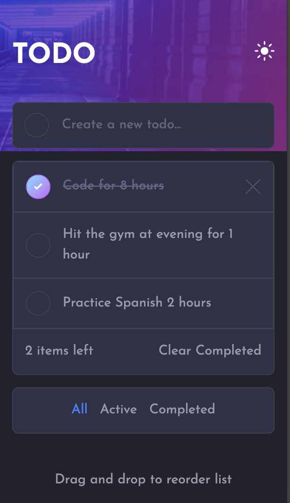

# Frontend Mentor - Todo app solution

This is a solution to the [Todo app challenge on Frontend Mentor](https://www.frontendmentor.io/challenges/todo-app-Su1_KokOW). Frontend Mentor challenges help you improve your coding skills by building realistic projects.

## Table of contents

- [Overview](#overview)
  - [The challenge](#the-challenge)
  - [Screenshot](#screenshot)
  - [Links](#links)
- [My process](#my-process)
  - [Built with](#built-with)
  - [What I learned](#what-i-learned)
- [Author](#author)

## Overview

### The challenge

Users should be able to:

- View the optimal layout for the app depending on their device's screen size
- See hover states for all interactive elements on the page
- Add new todos to the list
- Mark todos as complete
- Delete todos from the list
- Filter by all/active/complete todos
- Clear all completed todos
- Toggle light and dark mode
- **Bonus**: Drag and drop to reorder items on the list

### Screenshot

### Links

- Solution URL: [GitHub](https://github.com/piyush-kaushik24/todo-app)
- Live Site URL: [Todo app](https://todo-app-roan-theta-3by172c78p.vercel.app/)

## My process

### Built with

- Semantic HTML5 markup
- CSS custom properties
- Flexbox
- CSS Grid
- Mobile-first workflow
- [TypeScript](https://www.typescriptlang.org/)
- [React](https://react.dev/) - JS library
- [Tailwind CSS](https://tailwindcss.com/) - CSS framework

### What I learned

- Created unique Todo IDs for dynamically added tasks and learned about the limitations of crypto.randomUUID() in non-secure local network environments.

- Built a custom checkbox UI while keeping the native checkbox for proper semantics and accessibility.

- Practiced CSS animations and Tailwind arbitrary animation utilities to animate the Todo completion checkmark.

- Implemented light and dark themes using CSS variables and semantic color tokens.

- Practiced using useEffect and useRef for interactions such as detecting clicks outside a confirmation modal.

- Implemented Todo creation using a form and onSubmit, and learned why event.preventDefault() is needed in React applications.

## Author

- GitHub - [@piyush-kaushik24](https://github.com/piyush-kaushik24)
- Frontend Mentor - [@piyush-kaushik24](https://www.frontendmentor.io/profile/piyush-kaushik24)
